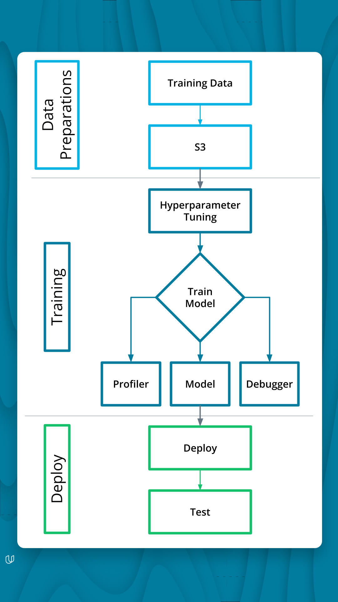
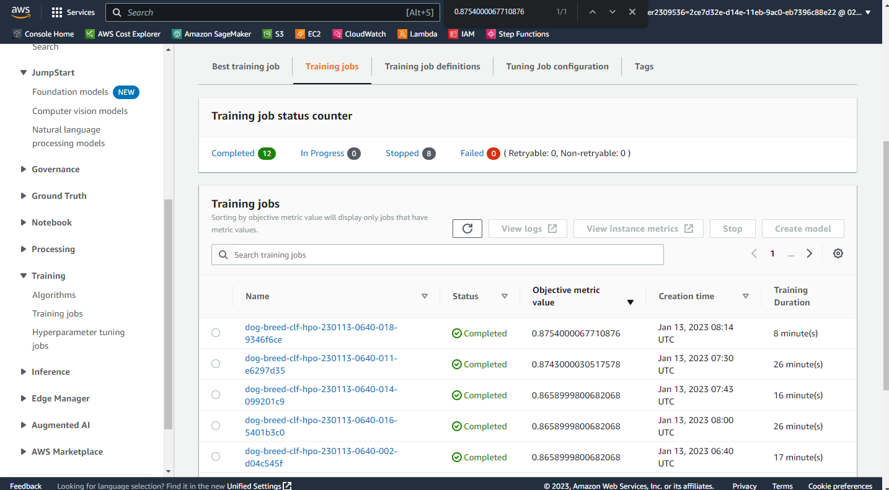
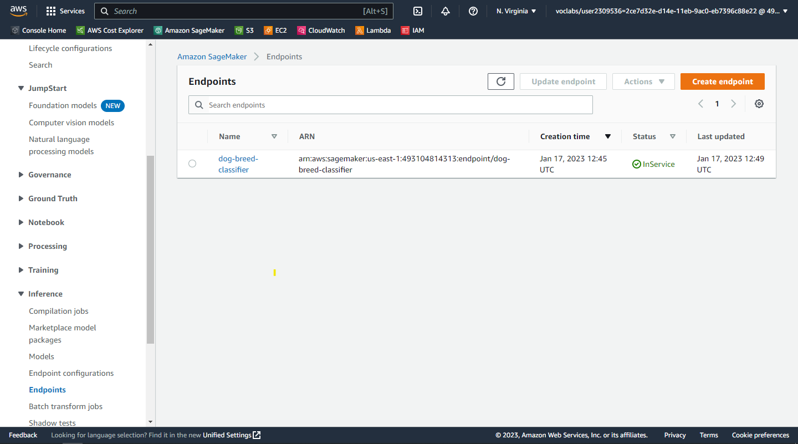
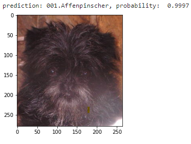

# Dog Breed Image Classifications with Pytorch (ResNet50) and AWS Sagemaker

The objective of this project is to create a deep learning model that is capable of identifying 133 different breeds of dogs. This project will use [Pytorch](https://pytorch.org/) as a deep learning framework and [Resnet50](https://pytorch.org/vision/main/models/generated/torchvision.models.resnet50.html) as a pre-trained model. The dataset used can be accessed from [here](https://s3-us-west-1.amazonaws.com/udacity-aind/dog-project/dogImages.zip). This project will outlines the process for an end-to-end image classification project, utilizing the resources and capabilities of AWS Sagemaker.

## Project Setup
1. Login to your AWS account and launch the sagemaker studio.
2. Clone this [repo](https://github.com/udacity/CD0387-deep-learning-topics-within-computer-vision-nlp-project-starter) as the starting point.
3. Complete the `hpo.py` file. It's required to do hyperparameter tuning.
4. Complete the `train_model.py` file. It's required to do Debugging and Profiling.
5. Create an `inference.py` file. It's required to deploy an endpoint.
6. Open train_and_deploy.ipynb
   >I use Python 3 (PyTorch 1.12 Python 3.8 GPU Optimized) kernel with pre-installed PyTorch libraries and ml.m3.medium as the cheapest instance just for running the notebook
7. Install dependencies
   ```
   pip install -Uqq pip awscli sagemaker smdebug
   ```
8. Download the dataset
   ```
   wget -nc https://s3-us-west-1.amazonaws.com/udacity-aind/dog-project/dogImages.zip
   ```  

## Project Pipeline
<div align='left'>
   
</div>
<div>
   <em>image by udacity</em>
<div>


## Project Overview

### Dataset
The datasets have been split to train, validation, and test set. The train set contains 6680 images divided into 133 classes corresponding to the dog breeds. The validation set contains 835 images and the test set contains 836 images.
### Hyperparameter Tuning
```python
hyperparameter_ranges = {
    "epochs": IntegerParameter(3, 21),
    "learning_rate": ContinuousParameter(1e-5, 0.1),
    "step_size": IntegerParameter(1, 3),
    "gamma": CategoricalParameter([0.25, 0.5]),
    "batch_size": CategoricalParameter([32, 64, 128, 256, 512]),
}
```
<div align='left'>
   
</div>

#### top 3 training job
  
| batch_size | epochs | gamma | learning_rate | step_size | TrainingJobName | TrainingJobStatus | FinalObjectiveValue | TrainingStartTime | TrainingEndTime | TrainingElapsedTimeSeconds |  |
|---:|---:|---:|---:|---:|---:|---:|---:|---:|---:|---:|---|
| "32" | 6.0 | "0.5" | 0.016581 | 1.0 | dog-breed-clf-hpo-230113-0640-018-9346f6ce | Completed | 0.8754 | 2023-01-13 08:14:08+00:00 | 2023-01-13 08:22:36+00:00 | 508.0 |  |
| "64" | 21.0 | "0.5" | 0.002352 | 3.0 | dog-breed-clf-hpo-230113-0640-011-e6297d35 | Completed | 0.8743 | 2023-01-13 07:30:34+00:00 | 2023-01-13 07:56:12+00:00 | 1538.0 |  |
| "256" | 21.0 | "0.25" | 0.015431 | 3.0 | dog-breed-clf-hpo-230113-0640-016-5401b3c0 | Completed | 0.8659 | 2023-01-13 08:00:47+00:00 | 2023-01-13 08:27:09+00:00 | 1582.0 |  |

#### best hyperparameters:
```python
{
   'batch_size': '32',
   'epochs': '6',
   'gamma': '0.5',
   'step_size': '1'
}
```
### Debugging and Profiling
#### Debugging Summary
|    | RuleConfigurationName    | RuleEvaluationJobArn                                                                                                 | RuleEvaluationStatus   | LastModifiedTime           | StatusDetails                                                                                                             |
|---:|:-------------------------|:---------------------------------------------------------------------------------------------------------------------|:-----------------------|:---------------------------|:--------------------------------------------------------------------------------------------------------------------------|
|  0 | VanishingGradient        | arn:aws:sagemaker:us-east-1:493104814313:processing-job/dog-breed-clf-dp-2023-01-1-vanishinggradient-93c4008b        | NoIssuesFound          | 2023-01-17 14:05:38.944000 | nan                                                                                                                       |
|  1 | Overfit                  | arn:aws:sagemaker:us-east-1:493104814313:processing-job/dog-breed-clf-dp-2023-01-1-overfit-118d191a                  | NoIssuesFound          | 2023-01-17 14:05:38.944000 | nan                                                                                                                       |
|  2 | Overtraining             | arn:aws:sagemaker:us-east-1:493104814313:processing-job/dog-breed-clf-dp-2023-01-1-overtraining-547807ea             | Error                  | 2023-01-17 14:05:38.944000 | InternalServerError: We encountered an internal error. Please try again.                                                  |
|  3 | PoorWeightInitialization | arn:aws:sagemaker:us-east-1:493104814313:processing-job/dog-breed-clf-dp-2023-01-1-poorweightinitialization-fbf738bd | IssuesFound            | 2023-01-17 14:05:38.944000 | RuleEvaluationConditionMet: Evaluation of the rule PoorWeightInitialization at step 0 resulted in the condition being met |
|  4 | LossNotDecreasing        | arn:aws:sagemaker:us-east-1:493104814313:processing-job/dog-breed-clf-dp-2023-01-1-lossnotdecreasing-5cc208d6        | Error                  | 2023-01-17 14:05:38.944000 | InternalServerError: We encountered an internal error. Please try again.                                                  |


#### Profiler Result
[profiler-report](./ProfilerReport/profiler-output/profiler-report.html)


### Model Deployment

#### inference testing
```python
test_classes = {v: k for k, v in test_dataset.class_to_idx.items()}

img_path = "./dogImages/test/001.Affenpinscher/Affenpinscher_00071.jpg"
with open(img_path,"rb") as img:
    b_img = img.read()
    
res = predictor.predict(b_img)
idx = torch.argmax(torch.tensor(res), 1)
pred_class = test_classes.get(idx.item())
probs = F.softmax(torch.tensor(res), 1).squeeze()
prob = probs[idx.item()]

preview = Image.open(img_path)
plt.imshow(preview)

print(f"prediction: {pred_class}, probability: {prob: .4f}")
```

